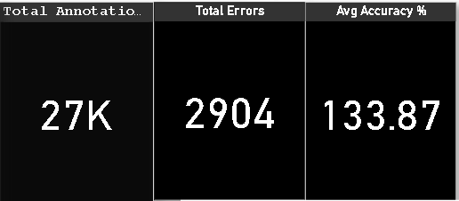

# 🧠 Annotation QA Dashboard | Power BI

This Power BI dashboard analyzes annotation task performance and quality. It helps track daily progress, annotator productivity, and overall QA status.

---

## 📌 Features

- ✅ Track total annotations and error counts
- 📉 Monitor average accuracy percentage
- 🧑‍💻 Compare performance by annotator
- 🎯 Analyze QA pass/fail breakdown
- 📆 View trends over time

---

## 📊 Dashboard Preview

---

## 🔍 Overview

This project visualizes annotation data including:
- Total annotations per day
- Errors per annotator
- Accuracy % per task
- QA Pass vs Fail stats

It's designed to help QA managers monitor quality in data labeling teams.

---

## 🗂️ Files Included

| File Name | Description |
|-----------|-------------|
| `Annotation_Quality_Dashboard.pbit` | Power BI file (interactive dashboard) |
| `Annotation_Quality_Dashboard.pdf` | Exported static report |
| `README.md` | Documentation and guide |

---

## 🚀 How to Use

1. Open `Annotation_Quality_Dashboard.pbit` in Microsoft Power BI
2. Load your annotation dataset (CSV or Excel)
3. Use filters and slicers to explore performance insights
4. Export visuals to PDF or share dashboard with your team

---

## ⚙️ Tools Used

- Microsoft Power BI
- Power Query Editor
- Conditional Columns
- DAX (Data Analysis Expressions)

---

## 🧑‍💼 Author

**Appu Anand**

- 🌐 GitHub: [Appu-Anand](https://github.com/Appu-Anand)
- 🔗 LinkedIn: www.linkedin.com/in/appuanand
- 📧 appu12anand@gmail.com
---

## 📎 License

This project is for educational and portfolio purposes only.

